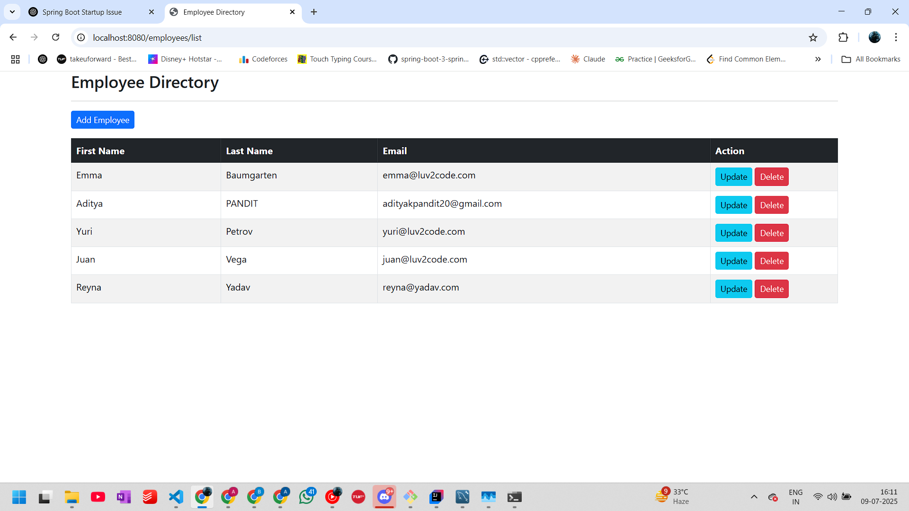

# Employee Management System

This is a Spring Boot-based CRUD application for managing employee data. It provides functionality to create, read, update, and delete employee records using Spring MVC, Spring Data JPA, Thymeleaf, and a MySQL database (or any other DB of your choice).




## 🚀 Features

- View all employees
- Add a new employee
- Update an existing employee
- Delete an employee
- Simple web interface with Thymeleaf

## 🛠 Technologies Used

- Java 17+
- Spring Boot
- Spring MVC
- Spring Data JPA
- Thymeleaf
- MySQL or H2
- Maven

## ⚙️ Getting Started

### Prerequisites

- Java JDK
- Maven
- MySQL (or use H2 in-memory DB)

### Setup

1. **Clone the repository**

   ```bash
   git clone https://github.com/yourusername/employee-management-system.git
   cd employee-management-system
Configure the database

Edit the file src/main/resources/application.properties:


spring.datasource.url=jdbc:mysql://localhost:3306/(use ur own)
spring.datasource.username= (use ur own)
spring.datasource.password=(use ur own)
spring.jpa.hibernate.ddl-auto=update
Run the application


./mvnw spring-boot:run
Visit in browser


http://localhost:8080/employees/list
📁 HTML Templates
list-employees.html – View all employees

employee-form.html – Form for adding/editing employees

helloworld.html – Basic test page

📦 Package Overview
controller – Web layer

dao – Data access

entity – Model definitions

service – Business logic

templates – UI templates

✍️ Author
Aditya Pandit

📃 License
This project is licensed under the MIT License - see the LICENSE file for details.


